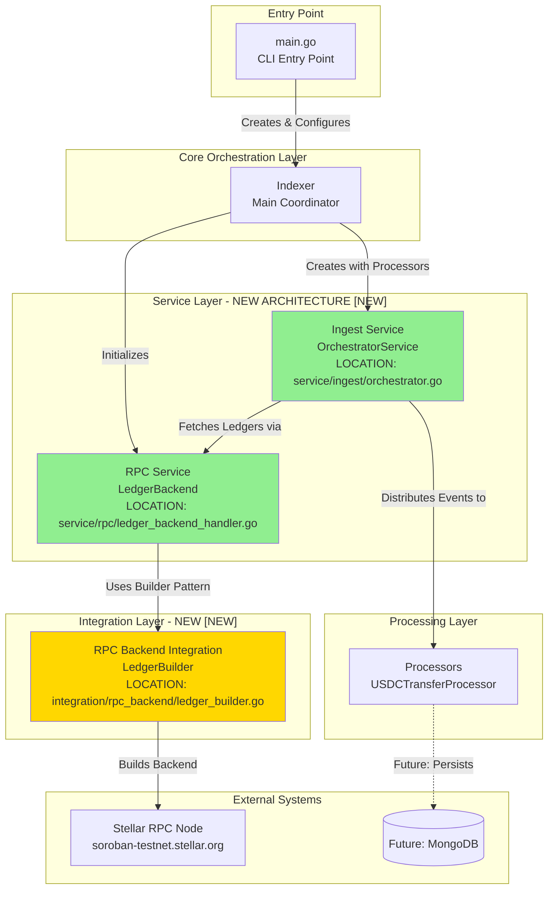
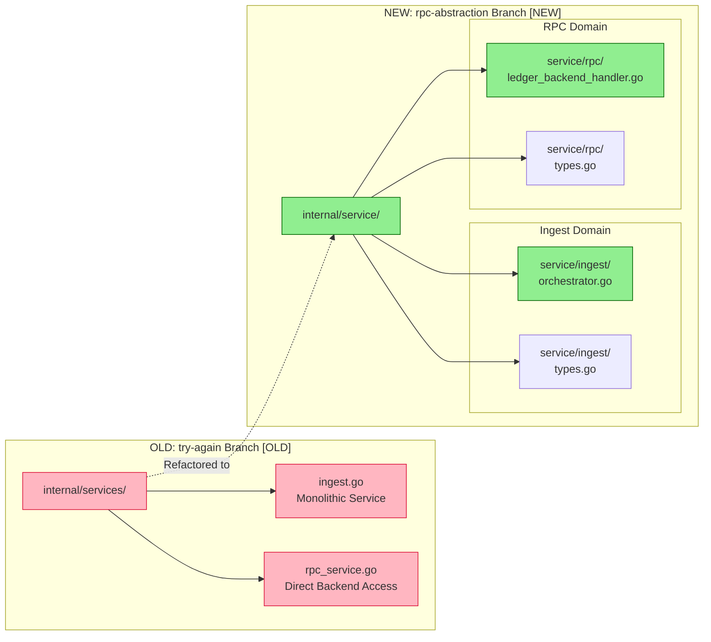
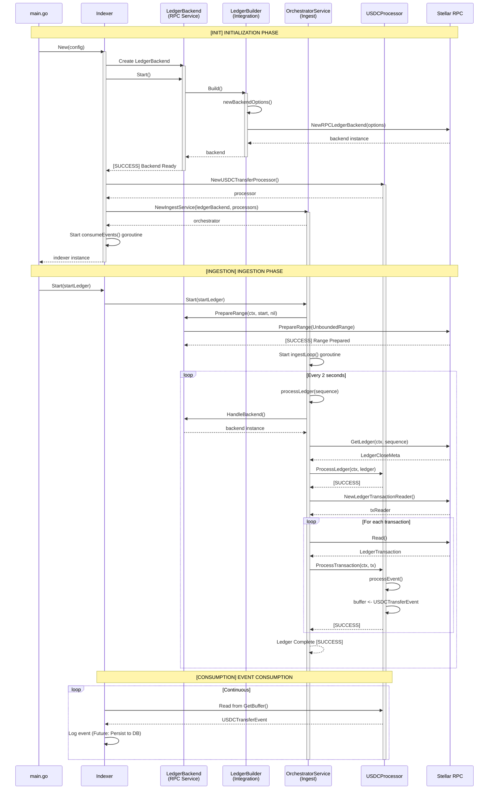
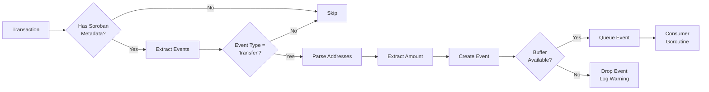
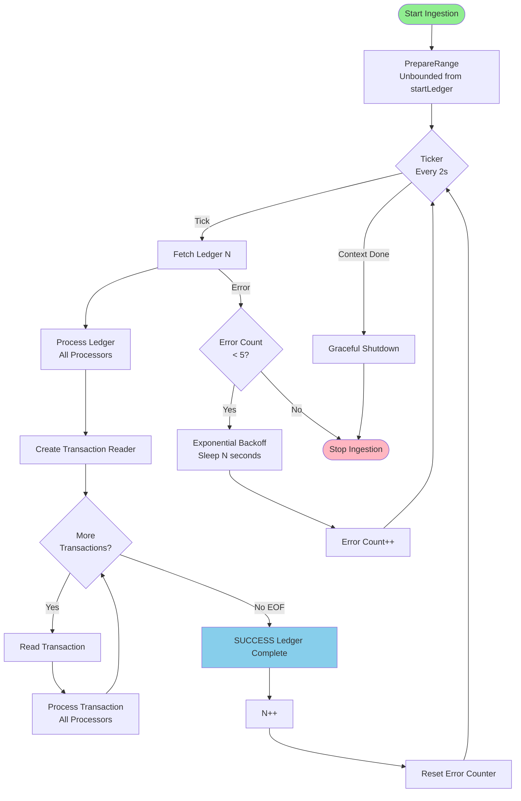
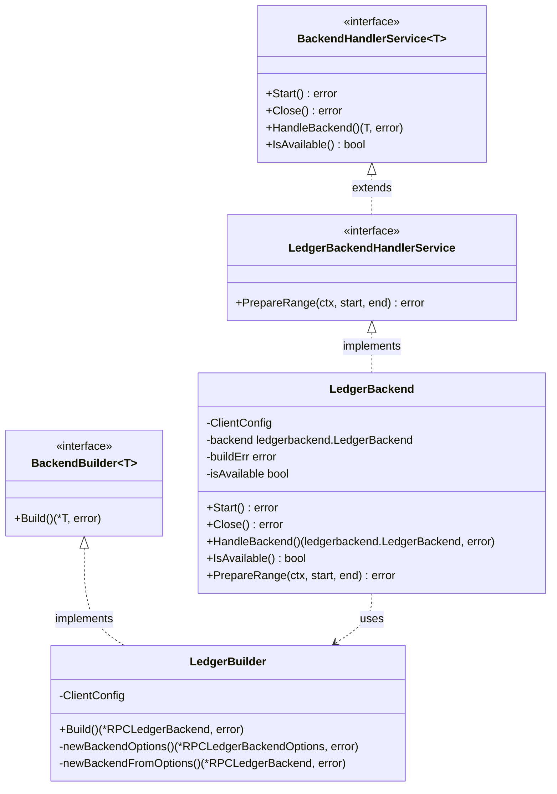
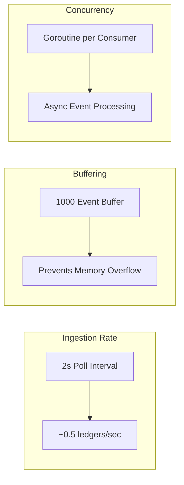
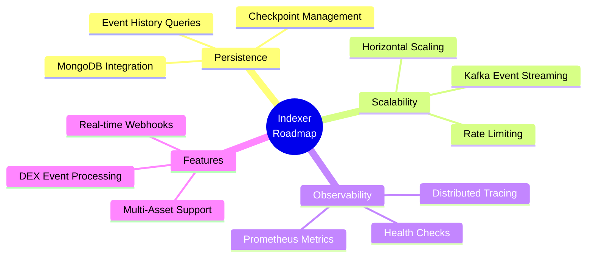
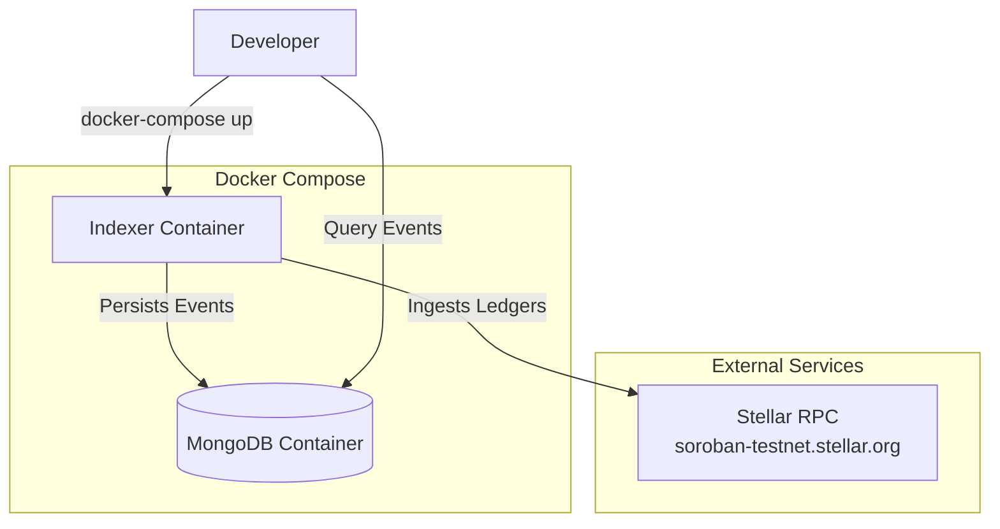

# Stellar Indexer - System Design Document

## Executive Summary

This document provides a high-level design (HLD) of the Stellar Indexer system, with special emphasis on the architectural improvements introduced in the `rpc-abstraction` branch compared to `try-again` branch. The system is designed to ingest, process, and index Stellar blockchain data with a focus on USDC transfer events.

---

## Architecture Overview



---

## Key Architectural Changes: `try-again` → `rpc-abstraction`

### 1. Service Layer Restructuring



**Changes:**
- **Renamed**: `internal/services/` → `internal/service/` (singular form)
- **Separated Concerns**: Split monolithic services into domain-specific packages
- **Type Definitions**: Added dedicated `types.go` files for interface contracts
- **Better Modularity**: Each service has clear responsibilities

---

### 2. RPC Backend Abstraction Layer

```mermaid
graph TB
    subgraph "OLD Architecture [OLD]"
        OLD_INGEST_SVC[IngestService]
        OLD_RPC_SVC[RPCService]
        OLD_BACKEND[Direct Backend Creation<br/>ledgerbackend.NewRPCLedgerBackend]

        OLD_INGEST_SVC -->|Tightly Coupled| OLD_RPC_SVC
        OLD_RPC_SVC -->|Creates Directly| OLD_BACKEND

        style OLD_INGEST_SVC fill:#FFB6C1
        style OLD_RPC_SVC fill:#FFB6C1
        style OLD_BACKEND fill:#FFB6C1
    end

    subgraph "NEW Architecture [NEW]"
        NEW_INGEST[OrchestratorService]
        NEW_RPC_HANDLER[LedgerBackend<br/>Handler]
        NEW_INTEGRATION[RPC Integration Layer]
        NEW_BUILDER[LedgerBuilder<br/>Builder Pattern]
        NEW_BACKEND[RPCLedgerBackend]

        NEW_INGEST -->|Uses Interface| RPC_INTERFACE
        RPC_INTERFACE[LedgerBackendHandlerService<br/>Interface]
        RPC_INTERFACE -->|Implemented by| NEW_RPC_HANDLER
        NEW_RPC_HANDLER -->|Delegates to| NEW_INTEGRATION
        NEW_INTEGRATION -->|Uses| NEW_BUILDER
        NEW_BUILDER -->|Builds| NEW_BACKEND

        style NEW_INGEST fill:#90EE90
        style NEW_RPC_HANDLER fill:#90EE90
        style NEW_INTEGRATION fill:#FFD700
        style NEW_BUILDER fill:#FFD700
        style RPC_INTERFACE fill:#87CEEB
    end
```



**Key Improvements:**
- **Interface-Based Design**: `LedgerBackendHandlerService` interface enables testability and flexibility
- **Builder Pattern**: `LedgerBuilder` encapsulates complex RPC backend construction
- **Integration Layer**: New `internal/integration/rpc_backend/` package separates external system integration
- **Lifecycle Management**: Explicit `Start()`, `Close()`, `IsAvailable()` methods

---

### 3. Component Interaction Flow



---

## Detailed Component Design

### Core Components

#### 1. Indexer (Main Coordinator)
**Location**: `internal/indexer/indexer.go`

**Responsibilities:**
- System initialization and configuration management
- Lifecycle orchestration (startup, shutdown)
- Signal handling (SIGINT, SIGTERM)
- Event consumption coordination

**Key Methods:**
- `New(config Config)`: Initializes all components
- `Start()`: Begins ingestion and blocks until shutdown
- `Stop()`: Graceful shutdown

**Configuration:**
```go
type Config struct {
    RPCEndpoint string  // Stellar RPC node URL
    StartLedger uint32  // Initial ledger sequence
    NetworkPass string  // Network passphrase (testnet/mainnet)
}
```

---

#### 2. OrchestratorService (Ingest Service) [NEW]

**Location**: `internal/service/ingest/orchestrator.go`

**Action Labels:**
- `[COORDINATE]` Ledger ingestion orchestration
- `[DISTRIBUTE]` Event distribution to processors
- `[RESILIENCE]` Error handling with exponential backoff

**Key Features:**
```go
type OrchestratorService struct {
    ledgerBackend rpc.LedgerBackendHandlerService  // Interface-based dependency
    processors    []Processor                       // Pluggable processors
    checkpointMgr CheckpointStore                   // Future: persistence
    ctx           context.Context                   // Lifecycle management
    cancel        context.CancelFunc
    wg            sync.WaitGroup
}
```

**Improvements over old `IngestService`:**
- Interface-based backend dependency (was concrete `*RPCService`)
- Better lifecycle management with context
- Improved error handling (max 5 consecutive errors)
- 2-second polling with configurable ticker

---

#### 3. LedgerBackend (RPC Service) [NEW]

**Location**: `internal/service/rpc/ledger_backend_handler.go`

**Action Labels:**
- `[MANAGE]` Backend lifecycle (Start, Close)
- `[PREPARE]` Ledger range configuration
- `[PROVIDE]` Backend access to consumers

**Interface Contract:**
```go
type LedgerBackendHandlerService interface {
    PrepareRange(ctx context.Context, start, end *uint32) error
    BackendHandlerService[ledgerbackend.LedgerBackend]
}

type BackendHandlerService[T any] interface {
    Start() error
    Close() error
    HandleBackend() (T, error)
    IsAvailable() bool
}
```

**Key Improvements:**
- Generic interface design for extensibility
- Explicit lifecycle states (`isAvailable` flag)
- Separated configuration from instantiation
- Bounded vs Unbounded range support

---

#### 4. RPC Backend Integration Layer [NEW]

**Location**: `internal/integration/rpc_backend/`

**Action Labels:**
- `[BUILD]` RPC backend construction
- `[CONFIGURE]` Client options setup
- `[VALIDATE]` Configuration validation

**Files:**
- `ledger_builder.go`: Builder implementation
- `types.go`: Configuration types and interfaces

**Builder Pattern Implementation:**
```go
type LedgerBuilder struct {
    ClientConfig ClientConfig
}

func (lw *LedgerBuilder) Build() (*ledgerbackend.RPCLedgerBackend, error) {
    // 1. Validate configuration
    // 2. Create backend options
    // 3. Instantiate RPC backend
    // 4. Return configured backend
}
```

**Configuration Structure:**
```go
type ClientConfig struct {
    Endpoint          string              // RPC URL
    BufferSize        int                 // Ledger buffer size
    NetworkPassphrase string              // Network identifier
    TimeoutConfig     ClientTimeoutConfig // Retry/timeout settings
}

type ClientTimeoutConfig struct {
    Timeout  int  // Request timeout (seconds)
    Retries  int  // Max retry attempts
    Interval int  // Retry interval (seconds)
}
```

---

### Processing Pipeline

#### 5. Processor Interface

**Location**: `internal/service/ingest/types.go`

**Action Labels:**
- `[PROCESS]` Ledger and transaction processing
- `[IDENTIFY]` Processor identification

```go
type Processor interface {
    Name() string
    ProcessLedger(ctx context.Context, ledger xdr.LedgerCloseMeta) error
    ProcessTransaction(ctx context.Context, tx ingest.LedgerTransaction) error
}
```

---

#### 6. USDCTransferProcessor

**Location**: `internal/indexer/processors/usdc_transfer_processor.go`

**Action Labels:**
- `[FILTER]` Contract event filtering
- `[PARSE]` Event data extraction
- `[BUFFER]` Event queuing

**Processing Flow:**


**Event Structure:**
```go
type USDCTransferEvent struct {
    Event                      // Base event info
    From   string              // Source address
    To     string              // Destination address
    Amount string              // Transfer amount (i128)
}

type Event struct {
    LedgerSequence uint32
    TxHash         string
    Type           string
    ContractID     string
}
```

---

## Data Flow Architecture

### Ledger Processing Pipeline



---

## Directory Structure Comparison

```
OLD (try-again):                     NEW (rpc-abstraction):
├── internal/                        ├── internal/
│   ├── services/          [OLD]     │   ├── service/           [NEW]
│   │   ├── ingest.go                │   │   ├── ingest/
│   │   └── rpc_service.go           │   │   │   ├── orchestrator.go
│   │                                │   │   │   └── types.go
│   │                                │   │   └── rpc/
│   │                                │   │       ├── ledger_backend_handler.go
│   │                                │   │       └── types.go
│   │                                │   │
│   │                                │   ├── integration/     [NEW]
│   │                                │   │   └── rpc_backend/
│   │                                │   │       ├── ledger_builder.go
│   │                                │   │       └── types.go
│   │                                │   │
│   ├── utils/             [OLD]     │   ├── util/            [RENAMED]
│   │   ├── https_client.go          │   │   ├── https_client.go
│   │   └── utils.go                 │   │   └── utils.go
│   │                                │   │
│   ├── indexer/                     │   ├── indexer/
│   │   └── indexer.go               │   │   ├── indexer.go  (Updated imports)
│   │                                │   │   ├── processors/
│   │                                │   │   └── types/
```

---

## Interface Design Patterns [NEW]

### Generic Backend Handler Pattern



**Benefits:**
- **Type Safety**: Generic interfaces ensure compile-time type checking
- **Testability**: Easy to mock interfaces for unit testing
- **Extensibility**: Support for multiple backend types (RPC, Captive Core)
- **Separation of Concerns**: Clear boundaries between layers

---

## Operational Characteristics

### Resilience Features

| Feature | Implementation | Location |
|---------|---------------|----------|
| **Error Handling** | Exponential backoff (max 5 errors) | `orchestrator.go:73-85` |
| **Graceful Shutdown** | Context cancellation + WaitGroup | `orchestrator.go:153-158` |
| **Signal Handling** | SIGINT/SIGTERM captured | `indexer.go:83-84` |
| **Buffer Overflow** | Non-blocking channel write | `usdc_transfer_processor.go:126-132` |

### Performance Characteristics



---

## Security & Configuration

### Configuration Management

**Environment-Based Configuration:**
```bash
# .env.example
RPC_ENDPOINT=https://soroban-testnet.stellar.org
START_LEDGER=1696100
NETWORK_PASSPHRASE=Test SDF Network ; September 2015
```

**CLI Flags (Priority Override):**
```bash
./indexer \
  --rpc https://custom-rpc.stellar.org \
  --start 1700000 \
  --network "Test SDF Network ; September 2015"
```

### Security Considerations

- **No Credential Storage**: RPC endpoints are public
- **Read-Only Operations**: System only reads blockchain data
- **Network Isolation**: Future: MongoDB credentials in environment variables
- **Error Information Leakage**: Errors logged but not exposed externally

---

## Future Enhancements



### Immediate TODOs (from code comments)

1. **Checkpoint Persistence** (`indexer.go:116`)
   - Implement MongoDB storage for processed events
   - Add checkpoint recovery on restart

2. **Latest Ledger Detection** (`main.go:27`)
   - Query RPC for latest ledger when `startLedger=0`
   - Automatic catch-up mechanism

3. **Asset Verification** (`usdc_transfer_processor.go:92`)
   - Proper USDC contract address validation
   - Support for both mainnet and testnet USDC

---

## Deployment Architecture



**Docker Compose Configuration:**
```yaml
# docker-compose.yml
services:
  indexer:
    build: .
    environment:
      - RPC_ENDPOINT=https://soroban-testnet.stellar.org
      - START_LEDGER=1696100
    depends_on:
      - mongodb

  mongodb:
    image: mongo:latest
    ports:
      - "27017:27017"
```

---

## Change Summary: try-again → rpc-abstraction

### Files Modified (13 files)

| Action | File | Lines Changed | Impact |
|--------|------|---------------|--------|
| **ADDED** [NEW] | `integration/rpc_backend/ledger_builder.go` | +46 | Builder pattern for RPC backends |
| **ADDED** [NEW] | `integration/rpc_backend/types.go` | +21 | Configuration types |
| **ADDED** [NEW] | `service/ingest/orchestrator.go` | +158 | Refactored ingest service |
| **ADDED** [NEW] | `service/ingest/types.go` | +21 | Interface definitions |
| **ADDED** [NEW] | `service/rpc/ledger_backend_handler.go` | +79 | RPC lifecycle management |
| **ADDED** [NEW] | `service/rpc/types.go` | +9 | Generic interfaces |
| **DELETED** [OLD] | `services/ingest.go` | -165 | Replaced by orchestrator |
| **DELETED** [OLD] | `services/rpc_service.go` | -83 | Replaced by handler |
| **RENAMED** [RENAMED] | `utils/ → util/` | - | Package naming consistency |
| **MODIFIED** | `indexer/indexer.go` | ~100 | Updated imports and integration |
| **MODIFIED** | `ingest/ingest.go` | +1 | Minor update |
| **MODIFIED** | `.gitignore` | +3 | Added build artifacts |

**Total Impact:**
- **+395 lines added** (new abstractions)
- **-295 lines removed** (old implementations)
- **Net: +100 lines** (with better separation of concerns)

---

## Conclusion

The `rpc-abstraction` branch represents a significant architectural improvement with the following Amazonian principles applied:

### Leadership Principles Demonstrated:

1. **Ownership**: Clear service boundaries and responsibilities
2. **Dive Deep**: Proper abstraction layers without over-engineering
3. **Invent and Simplify**: Builder pattern, generic interfaces
4. **Think Big**: Extensible design for future backend types
5. **Insist on Highest Standards**: Interface-based design, testability

### Key Metrics:

- **Cohesion**: [IMPROVED] Improved (domain-specific packages)
- **Coupling**: [REDUCED] Reduced (interface-based dependencies)
- **Testability**: [IMPROVED] Enhanced (mockable interfaces)
- **Maintainability**: [IMPROVED] Improved (clear separation of concerns)
- **Extensibility**: [IMPROVED] Enhanced (generic patterns)

---

## References

### Code Locations

| Component | Path | Line Reference |
|-----------|------|----------------|
| Ingest Orchestrator | `internal/service/ingest/orchestrator.go` | Full file |
| RPC Handler | `internal/service/rpc/ledger_backend_handler.go` | Full file |
| Ledger Builder | `internal/integration/rpc_backend/ledger_builder.go` | Full file |
| Main Indexer | `internal/indexer/indexer.go` | Full file |
| USDC Processor | `internal/indexer/processors/usdc_transfer_processor.go` | Full file |

### External Dependencies

- **Stellar Go SDK**: `github.com/stellar/go`
- **Go Version**: 1.25.0+
- **Network**: Stellar Testnet (configurable)

---

**Document Version**: 1.0
**Branch**: feat/rpc-abstraction
**Author**: Generated by Claude Code (Amazonian SDE)
**Last Updated**: 2025-11-22